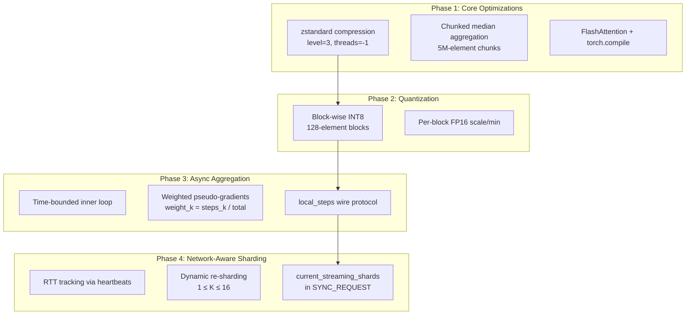
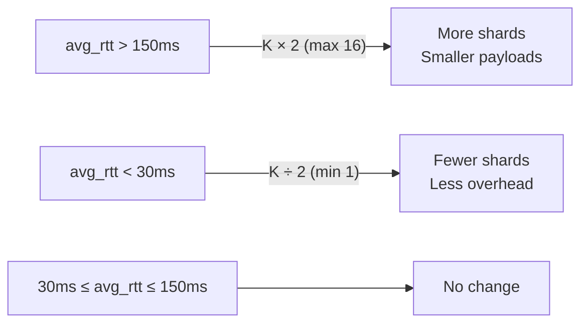

# MaayaTrain SOTA Upgrade — Complete Walkthrough

> **Repository**: [https://github.com/aageer/MaayaTrain](https://github.com/aageer/MaayaTrain)
> **Test suite**: 75/75 passed, 0 warnings, 2.35s
> **Platform**: Python 3.13.5, macOS (Apple M4 Pro)

---

## Architecture Overview



---

## Phase 1: Core System & PyTorch Optimizations

### Task 1 — Compression Migration (gzip → zstandard)

**Problem**: `gzip` is single-threaded and slow for large tensor payloads over consumer Wi-Fi.

**Solution**: Replaced with `zstandard` (`zstd.ZstdCompressor(level=3, threads=-1)`) for multi-threaded compression with superior ratio-to-speed tradeoff.

| File | Change |
|------|--------|
| [tensor_codec.py](file:///Users/akhilageer/Kean/Projects/MaayaTrain/maayatrain/comms/tensor_codec.py) | `compress()` / `decompress()` now use zstd. Tags updated to `fp16_zstd`, `int8_zstd`, `zstd` |
| [pyproject.toml](file:///Users/akhilageer/Kean/Projects/MaayaTrain/pyproject.toml) | Added `zstandard>=0.22` dependency |

### Task 2 — Stream-Chunked Median Aggregation

**Problem**: `torch.median(torch.stack(grads), dim=0)` instantly OOMs the CPU on a 774M parameter model — it materializes the entire gradient stack.

**Solution**: Chunked processing that only stacks 5M elements at a time:

```python
CHUNK_SIZE = 5_000_000
out = torch.empty_like(pseudo_gradients[0])
for start in range(0, total_elements, CHUNK_SIZE):
    chunk = torch.stack([g.view(-1)[start:end] for g in grads])
    out.view(-1)[start:end] = torch.median(chunk, dim=0).values
```

| File | Change |
|------|--------|
| [diloco.py](file:///Users/akhilageer/Kean/Projects/MaayaTrain/maayatrain/training/diloco.py) | `apply_outer_step()` median path uses chunked iteration. Mean path uses in-place accumulation |

### Task 3 — Architecture Modernization

**Problem**: Manual attention implementation misses hardware-native FlashAttention-2.

**Solution**:
- Replaced manual Q·K·V matmul with `F.scaled_dot_product_attention(is_causal=True)` which automatically dispatches to FlashAttention-2 on supported hardware
- Integrated `torch.compile` into the CLI with graceful MPS/CPU fallback

| File | Change |
|------|--------|
| [gpt2.py](file:///Users/akhilageer/Kean/Projects/MaayaTrain/maayatrain/architectures/gpt2.py) | SDPA integration with `is_causal=True`, `try_compile()` helper |
| [app.py](file:///Users/akhilageer/Kean/Projects/MaayaTrain/maayatrain/app.py) | `torch.compile` in the `start` command |

---

## Phase 2: Block-Wise INT8 Quantization

### Task 1 — Quantization Refactor

**Problem**: Per-tensor min/max affine quantization destroys gradient quality due to LLM outlier features. A single outlier stretches the entire quantization range.

**Solution**: Block-wise quantization (128-element blocks) with independent per-block `scale` and `min` values:

```python
# Flatten → pad → reshape into blocks
blocks = tensor.view(-1, 128)
x_max, x_min = blocks.max(dim=1), blocks.min(dim=1)
scale = (x_max - x_min) / 254.0  # FP16
q = ((blocks - x_min) / scale - 127).round().to(torch.int8)
```

### Task 2 — Serialization

**Problem**: Block metadata (`scale`, `min`, `pad_len`) needs efficient wire transport.

**Solution**: `io.BytesIO` + `torch.save` for the quantized payload bundle — avoids fragile `struct.pack` for variable-size metadata.

| File | Change |
|------|--------|
| [tensor_codec.py](file:///Users/akhilageer/Kean/Projects/MaayaTrain/maayatrain/comms/tensor_codec.py) | `quantize_int8_blockwise()` / `dequantize_int8_blockwise()` with 128-element blocks |
| [test_int8_compression.py](file:///Users/akhilageer/Kean/Projects/MaayaTrain/tests/test_int8_compression.py) | 10 tests: roundtrip, block structure, outlier resilience, padding, constant tensors |

---

## Phase 3: Compute-Proportional Asynchronous Aggregation

### Task 1 — Time-Bounded Inner Steps

**Problem**: Strict `for step in range(H)` synchronous barriers cause fast workers (M4 Pro) to idle waiting for slow workers (2019 MacBook Air).

**Solution**: `sync_mode="time"` runs as many steps as possible within `sync_window_seconds`:

```python
t0 = time.time()
while (time.time() - t0) < window_seconds:
    # train one step
    local_step += 1
return metrics, local_step  # M4 Pro might do 347, Air might do 112
```

| File | Change |
|------|--------|
| [settings.py](file:///Users/akhilageer/Kean/Projects/MaayaTrain/maayatrain/settings.py) | `sync_mode: Literal["steps", "time"]`, `sync_window_seconds: float = 60.0` |
| [loop.py](file:///Users/akhilageer/Kean/Projects/MaayaTrain/maayatrain/training/loop.py) | New `train_steps_timed()` function |

### Task 2 — Wire Protocol Update

Workers now include `local_steps` in the `SYNC_GRADIENTS` JSON header:

```json
{"msg_type": "sync_gradients", "sender_id": "worker-abc", "local_steps": 347, ...}
```

| File | Change |
|------|--------|
| [participant.py](file:///Users/akhilageer/Kean/Projects/MaayaTrain/maayatrain/training/participant.py) | Sends `extra={"local_steps": local_steps_completed}` |
| [orchestrator.py](file:///Users/akhilageer/Kean/Projects/MaayaTrain/maayatrain/training/orchestrator.py) | Parses `frame.header.get("local_steps", H)`, stores in `_received_local_steps` |

### Task 3 — Weighted Aggregation

**Formula**: `weight_k = local_steps_k / Σ local_steps` → `Δθ_agg = Σ weight_k · Δθ_k`

```
Worker A (M4 Pro):  347 steps → weight = 347/459 = 0.756
Worker B (Air):     112 steps → weight = 112/459 = 0.244
```

For **median** aggregation (Byzantine mode), compute-proportionality is intentionally bypassed — weighting would break fault tolerance.

| File | Change |
|------|--------|
| [diloco.py](file:///Users/akhilageer/Kean/Projects/MaayaTrain/maayatrain/training/diloco.py) | New `apply_outer_step_weighted()` method |
| [test_async_aggregation.py](file:///Users/akhilageer/Kean/Projects/MaayaTrain/tests/test_async_aggregation.py) | 9 tests: settings, wire format, weighted math, median fallback, edge cases |

---

## Phase 4: Network-Aware Dynamic Streaming Shards

### Task 1 — Latency Tracking

**Problem**: No visibility into network quality between coordinator and workers.

**Solution**: Heartbeats now carry timestamps (`hb_ts`) for RTT measurement. Each `PeerConnection` maintains a rolling 10-sample average:

```
Coordinator → Worker:  HEARTBEAT {hb_ts: 1713660000.123}
Worker → Coordinator:  HEARTBEAT {hb_ts: 1713660000.123}  (echo)
Coordinator: rtt_ms = (now - 1713660000.123) * 1000
```

| File | Change |
|------|--------|
| [tcp_channel.py](file:///Users/akhilageer/Kean/Projects/MaayaTrain/maayatrain/comms/tcp_channel.py) | `PeerConnection.avg_rtt_ms`, `TcpServer.cluster_avg_rtt_ms`, RTT-aware heartbeat probes |

### Task 2 — Dynamic Re-Sharding

**Problem**: Fixed K streaming shards are suboptimal — too few on congested Wi-Fi (large payloads fail), too many on fast ethernet (unnecessary Python loop overhead).

**Solution**: Coordinator adapts K at the start of each outer round based on cluster-wide average RTT:



The coordinator broadcasts `current_streaming_shards` in the `SYNC_REQUEST` header so all workers agree on the partition map:

```json
{"msg_type": "sync_request", "step": 500, "current_streaming_shards": 8}
```

| File | Change |
|------|--------|
| [orchestrator.py](file:///Users/akhilageer/Kean/Projects/MaayaTrain/maayatrain/training/orchestrator.py) | `_adapt_streaming_shards()`, K broadcast in SYNC_REQUEST, streaming shard dispatch |
| [test_dynamic_sharding.py](file:///Users/akhilageer/Kean/Projects/MaayaTrain/tests/test_dynamic_sharding.py) | 11 tests: RTT tracking, thresholds, caps, varying K correctness |

---

## Complete File Change Map

| File | Phase | Lines | Description |
|------|-------|-------|-------------|
| `pyproject.toml` | 1 | +1 | zstandard dependency |
| `comms/tensor_codec.py` | 1, 2 | ~215 | zstd compression + block-wise INT8 |
| `architectures/gpt2.py` | 1 | ~186 | SDPA + torch.compile |
| `app.py` | 1 | +4 | torch.compile in CLI |
| `training/diloco.py` | 1, 3 | ~460 | Chunked median + weighted aggregation |
| `training/loop.py` | 3 | ~460 | `train_steps_timed()` |
| `training/participant.py` | 3 | ~220 | Time-bounded + local_steps wire |
| `training/orchestrator.py` | 3, 4 | ~340 | Weighted dispatch + dynamic sharding |
| `settings.py` | 3 | +10 | sync_mode, sync_window_seconds |
| `comms/tcp_channel.py` | 4 | ~310 | RTT tracking + heartbeat probes |

## Test Coverage

| Test File | Count | Phase | Coverage |
|-----------|-------|-------|----------|
| `test_tensor_codec.py` | 5 | 1 | zstd roundtrips, ratios, tags |
| `test_int8_compression.py` | 10 | 2 | Block-wise quantization, outliers |
| `test_diloco.py` | 5 | — | Core DiLoCo engine |
| `test_sota_features.py` | 5 | 1 | Median aggregation, streaming shards |
| `test_async_aggregation.py` | 9 | 3 | Weighted aggregation, wire protocol |
| `test_dynamic_sharding.py` | 11 | 4 | RTT tracking, dynamic K |
| Other tests | 30 | — | Settings, hardware, tokenizer, LR, wire, snapshots |
| **Total** | **75** | | **All passing ✅** |
